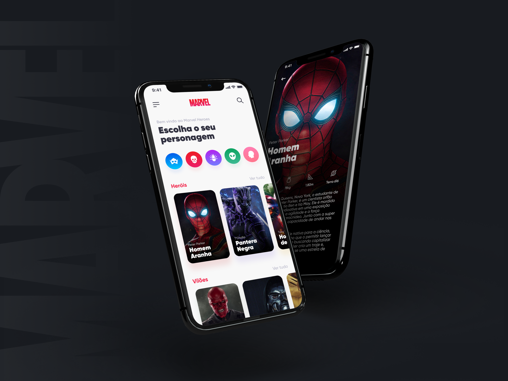

<h4 align="center">
    <a href="https://umpontoseis.com/">
        
    </a>
</h4>

<h4 align="center">
    
</h4>

<h2 id="about">About</h2>

This is the second project of **[umpontoseis](https://umpontoseis.com/)**  created from designers to developers that brings with it the intention of perfecting our skills and strengthening professional ties.

The challenge is to create an application that presents the characters of the Marvel universe in a simple and elegant interface. For this purpose, all the assets of the proposed front-end were made available through **[figma](https://www.figma.com/community/file/849367817302905364)**, as well as the JSON that contains the list of characters and movie data for the creation of the fake api.

<h2 id="layout">Layout</h2>

<p align="center">
    
</p>

<h2 id="technologies-used">Technologies used</h2>
    <table>
        <tr>
            <th>Library or Framework</th>
        </tr>
        <tr>
            <td> 
                <a href="https://ionicframework.com/">
                    Ionic | Angular
                </a>
            </td>
        </tr>
    </table>

<h2 id="how-to-run">How to run</h2>

```bash
# clone this repository
$ git clone https://github.com/andrew8gmf/marvel-heroes.git

# access the project folder
$ cd marvel-heroes

# install the dependencies
$ yarn install

# run the application
$ yarn start
```

<h2 id="how-to-contribute">How to contribute</h2>

- Make a fork of this repository
- Clone to you machine and entry on respective paste
- Create a branch with your resource: `git checkout -b my-feature`
- Commit your changes: `git commit -m 'feat: My new feature'`
- Push your branch: `git push origin my-feature`
    > [guide on how to contribute on github](https://github.com/firstcontributions/first-contributions)